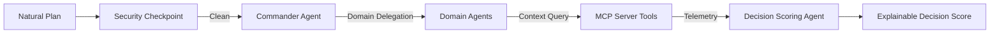
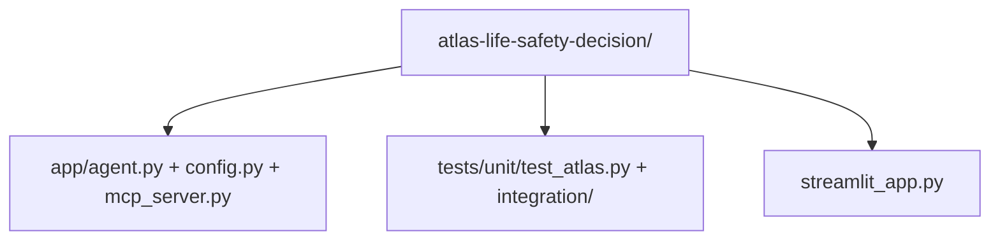

# 🛡️ ATLAS: System Architecture Overview

This presentation slide describes the multi-agent orchestration, security layers, and data sources powering the ATLAS Life-Safety Decision Agent.

---

## Slide 1: High-Level Pipeline

### 🎙️ Narration / Explainer Notes:
1. **The Entry Gateway:** Every natural language plan inputted by the user is first intercepted by the **Safety Policy Agent** (the Security Checkpoint). This node runs regex PII scrubbers, injection keyword scanners, and filters out unsafe actions.
2. **Decoupled Orchestration:** Once validated, the plan is passed to the **Commander Agent**. Using standard ADK `AgentTool` delegation, the Commander routes the query to the correct sub-agent depending on the plan type.
3. **Local Safety Telemetry:** Domain-specific sub-agents query the **ATLAS MCP Server** via standard tools (weather alerts, air quality indexes, active flood signals, and hygienic dining checks).
4. **Scoring & Explanation:** The **Decision Scoring Agent** receives the consolidated safety telemetry, calculates a weighted score (0-100), and outputs a one-line overall reason alongside a structured breakdown for full explainability.

---

## Slide 2: Codebase & Modules Layout

### 🎙️ Narration / Explainer Notes:
1. **Core Agent Code (`app/agent.py`):** Holds the 5-agent graph workflow, schema structures, scoring models, and PII redactor.
2. **Local Safety Database (`app/mcp_server.py`):** Exposes stdio tools to the agents using the Python `mcp` SDK.
3. **Testing Rig (`tests/`):** Contains unit and E2E integration tests validating 100% of the security and intent logic deterministically.
4. **Mission Control Interface (`streamlit_app.py`):** Runs the graph entirely offline for demo evaluations, complete with history and favorites.
